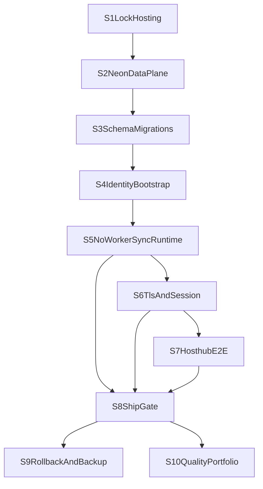

# EPICS 2 - Household ship path (A1 managed, no dedicated worker)

This is the execution playbook for shipping Stay Ops Planner for one household
(you + father) on a managed stack, with sync handled in web/API flows (no
dedicated queue worker).

Ship path: execute S1 through S9 in order, then treat S10 as ongoing quality work.

## Locked production decisions

- Web/API host: Vercel (`apps/web`)
- Deployment policy: auto-deploy to production from `main`
- Data plane: single Neon Postgres production database (`DATABASE_URL`)
- Migrations: run in CI/deploy pipeline; deployment blocks on migration failure
- Identity bootstrap: seed script creates admin + father account
- Sync triggers: login debounce + manual endpoint + hourly daytime cron
- Overlap behavior: return `409` with stable `sync already running` response
- Failure policy: log and surface Hosthub failures to operators
- Observability baseline: structured logs, error tracking, uptime checks, DB sync audit records
- Go/no-go authority: you + father
- Operability baseline: rollback rehearsal + DB restore rehearsal required

## Execution sequence (hard order)

Hard-stop rule: if an epic gate fails, do not start the next epic.

## No-worker sync contract (normative)

1. Sync runs only from server endpoints.
2. Login-triggered sync is debounced with cooldown window.
3. Manual sync trigger is authenticated/authorized and rate-limited.
4. Cron sync trigger is protected by secret/header contract.
5. Single-flight DB lock enforces one active run at a time.
6. Overlap returns `409` with message `sync already running`.
7. Lock release is guaranteed on success and failure paths.
8. Every run records start, finish/fail, and correlation metadata.

## Production daytime cron policy

- Timezone source: `APP_TIMEZONE` (must be set and documented).
- Cadence: hourly.
- Window: daytime local hours only (define exact hours in private operator note).
- Endpoint: protected sync cron route with shared secret/header verification.
- Coexistence: cron, login, and manual triggers all use same single-flight lock.
- Required evidence: at least one valid daytime cron invocation and one skipped/blocked
  overlap event visible in logs/audit.

## Ship epics (implementation steps)

### Ship-Epic S1 - Lock hosting story

**Purpose:** lock platform assumptions before implementation churn.  
**Depends on:** none.  
**Owner:** you.

Prechecks:
- Existing deploy target is known (`main` -> production).
- Current operator note location is decided (private notes/password manager).

Checklist:
- [ ] Record the A1 deployment sentence in a private operator note (copy from canonical block in [runbooks/production-deploy.md](./runbooks/production-deploy.md)):
  - "Production runs on Vercel + Neon with no dedicated worker; sync runs from protected
    web endpoints with DB single-flight locking."
- [ ] Confirm `main` is treated as production deploy branch (verify in Vercel **Production Branch** settings).
- [x] Confirm all operators understand that Redis/worker is out of scope for this ship path ([README](../README.md) ship baseline + same runbook; `packages/worker` remains dev/docker-only).

Expected result:
- One canonical architecture sentence exists and is reused in deploy/release notes.

Failure triage:
- If team wording differs, stop and reconcile language before S2.
- If someone expects worker/Redis in baseline, mark no-ship-path alignment and resolve first.

Evidence:
- Runbook publishes the verbatim A1 sentence and S1 **private-note template** → [runbooks/production-deploy.md](./runbooks/production-deploy.md).
- Private note exists with architecture sentence, date, owner initials, and link to that runbook (operator action; template is plaintext in runbook section **S1 private operator note template**).

Gate:
- A1 sentence is stable and agreed by all ship-gate approvers.

Stop conditions:
- Any unresolved disagreement on hosting, DB target, sync trigger model, or lock behavior.

### Ship-Epic S2 - Provision data plane (Neon Postgres)

**Purpose:** establish one durable shared source of truth.  
**Depends on:** S1.  
**Owner:** you.

Prechecks:
- S1 gate is complete.
- Production Neon project/database exists or can be created.

Checklist:
- [ ] Provision one production Neon database and capture connection string.
- [ ] Set production `DATABASE_URL` in Vercel project environment variables.
- [ ] Validate required production env matrix from [../.env.example](../.env.example).
- [ ] Confirm runtime and migration contexts point to the same Neon DB.

Commands:
- `pnpm --filter @stay-ops/db migrate:deploy` (against production environment), **or**
- GitHub Actions **Migrate production DB** (`workflow_dispatch`): [`.github/workflows/migrate-production.yml`](../.github/workflows/migrate-production.yml) using Environment **`production`** and secret **`DATABASE_URL`** (Neon; see [production-deploy.md](./runbooks/production-deploy.md)).

Optional verification (does not migrate; proves runtime DB reachability from app edge):
- **Verify production readiness** (`workflow_dispatch`): [`.github/workflows/verify-production-readiness.yml`](../.github/workflows/verify-production-readiness.yml) with full **`https://…/api/health/ready`** URL; repo secret **`VERCEL_AUTOMATION_BYPASS_SECRET`** if Vercel Deployment Protection applies.

Expected result:
- Production runtime and migration execution are both pointed at the exact same Neon DB.

Failure triage:
- If migration command cannot connect, re-check `DATABASE_URL` format and Vercel env scope.
- If runtime points to a different DB than migrations, stop and correct env scoping before S3.

Evidence:
- Screenshot/export of Vercel env showing `DATABASE_URL` configured (secret redacted).
- Migration command output with successful DB connectivity — from a trusted CLI session **and/or** a completed **Migrate production DB** Actions run summary (no secrets pasted in logs beyond GitHub masking).
- Optional: **Verify production readiness** Actions run summary showing HTTP 200 and `checks.db: "ok"` for the deployed URL.

Gate:
- Migration context and runtime context both resolve to the same Neon production DB.

Stop conditions:
- Any evidence of split-brain DB configuration (runtime/migration mismatch).

### Ship-Epic S3 - Apply schema (migrations)

**Purpose:** enforce schema correctness before identity and traffic.  
**Depends on:** S2.  
**Owner:** you.

Prechecks:
- S2 gate is complete.
- Target branch contains final intended migration files.

Checklist:
- [ ] Ensure migration files in [../packages/db/prisma/migrations](../packages/db/prisma/migrations)
  are current for the release branch.
- [ ] Run `migrate:deploy` in deploy pipeline before production release.
- [ ] Block deployment if migration step fails.
- [ ] Validate post-migration schema status and key table presence.

Commands:
- `pnpm --filter @stay-ops/db migrate:deploy`

Expected result:
- Schema on production DB is at expected migration head for the deployed revision.

Failure triage:
- If migration fails, do not deploy app changes; investigate SQL error and dependency ordering.
- If migration succeeds locally but fails in deploy pipeline, verify production env parity.

Evidence:
- CI/deploy log showing successful migration step.
- Deployment log proving production promotion is blocked on migration failure.

Gate:
- Latest deploy target has clean migration execution and expected schema.

Stop conditions:
- Any migration failure without a clean rerun and verified schema state.

### Ship-Epic S4 - Bootstrap identity

**Purpose:** ensure safe authenticated operator access.  
**Depends on:** S3.  
**Owner:** you.

Prechecks:
- S3 gate is complete.
- Bootstrap email/password values are set in production secrets.

Checklist:
- [ ] Set `BOOTSTRAP_ADMIN_EMAIL` and `BOOTSTRAP_ADMIN_PASSWORD` in production env.
- [ ] Run seed workflow for production DB.
- [ ] Ensure father account is provisioned with intended role.
- [ ] Rotate any default/bootstrap password immediately after first successful login.

Commands:
- `pnpm --filter @stay-ops/db seed`

Expected result:
- Admin and father accounts can authenticate with intended roles and no placeholder secrets.

Failure triage:
- If seed succeeds but login fails, verify auth env/session settings and seeded identity values.
- If role is incorrect, correct role assignment before any sync/runtime verification.

Evidence:
- Seed job output with success.
- Successful login proof for admin and father role accounts.
- Password rotation confirmation note.

Gate:
- At least one admin login and one father account login succeed on production URL.

Stop conditions:
- Missing operator access, wrong role mapping, or unrotated bootstrap credentials.

### Ship-Epic S5 - Web runtime and sync endpoints (no worker)

**Purpose:** run complete production behavior without worker dependency.  
**Depends on:** S2-S4.  
**Owner:** you.

Prechecks:
- S2-S4 gates are complete.
- Hosthub and webhook env values are present in production where required.

Checklist:
- [ ] Deploy `apps/web` to production.
- [ ] Validate protected sync endpoints are reachable only with valid auth/secret.
- [ ] Validate login-triggered sync debounce behavior.
- [ ] Validate manual sync trigger for authorized role.
- [ ] Validate cron trigger auth contract and hourly daytime schedule.
- [ ] Validate overlap handling returns `409` + `sync already running`.
- [ ] Validate audit records are written for start/success/failure.

Expected result:
- Sync executes only from protected server paths and enforces single-flight semantics.

Failure triage:
- If overlap requests run concurrently, treat as critical locking defect and stop progression.
- If endpoints respond without auth/secret checks, close exposure before continuing.
- If debounce does not work, stabilize trigger logic before S6.

Evidence:
- Deployed URL and successful API health responses.
- One successful sync run trace and one overlap `409` trace.
- Audit record entries for both runs.

Gate:
- Sync semantics match no-worker contract end-to-end.

Stop conditions:
- Any breach of auth protection, lock semantics, or audit trail completeness.

### Ship-Epic S6 - TLS edge and cookie behavior

**Purpose:** validate real browser behavior under HTTPS.  
**Depends on:** S5.  
**Owner:** you.

Prechecks:
- S5 gate is complete.
- Public `*.vercel.app` URL is reachable over HTTPS.

Checklist:
- [ ] Verify production login works on `https://*.vercel.app`.
- [ ] Validate session cookie behavior (`Secure`, same host continuity, expected persistence).
- [ ] Validate repeated cold-session login from a clean browser profile.

Expected result:
- Users can log in repeatedly with stable session behavior on production hostname.

Failure triage:
- If cookie is not persisted or secure flags are wrong, fix cookie/auth config before S7.
- If hostname shifts between login and authenticated requests, correct host consistency first.

Evidence:
- Browser devtools screenshots showing expected cookie flags and request host consistency.
- Short operator note confirming repeated login stability.

Gate:
- HTTPS login and authenticated follow-up requests are stable on production hostname.

Stop conditions:
- Intermittent login/session failures in clean browser tests.

### Ship-Epic S7 - Hosthub required end-to-end

**Purpose:** prove sync truth in production context.  
**Depends on:** S6.  
**Owner:** you.

Prechecks:
- S6 gate is complete.
- Hosthub credentials and endpoint details are verified in production env.

Checklist:
- [ ] Validate Hosthub credentials and webhook secret values in production env.
- [ ] Trigger one production-context sync via approved trigger path.
- [ ] Verify data persistence result in DB and UI visibility.
- [ ] Trigger one controlled failure path and verify clear surfaced operator error.
- [ ] Confirm lock release on both success and failure path.

Expected result:
- Hosthub sync produces traceable successful writes and observable, recoverable failures.

Failure triage:
- If success path writes are missing, inspect request payload mapping and DB persistence logs.
- If failure path has no clear surfaced error, add/repair operator-visible error reporting.
- If lock is not released after failure, treat as blocker and fix before S8.

Evidence:
- One successful Hosthub sync trace with correlation metadata.
- One failed Hosthub path trace with clear surfaced error.
- DB/audit proof that lock is released after each path.

Gate:
- Hosthub success and failure paths are both observable and recoverable.

Stop conditions:
- Missing success trace, missing failure trace, or lock release not guaranteed.

### Ship-Epic S8 - Verification gate (ship / no-ship)

**Purpose:** enforce a binary ship decision before family traffic.  
**Depends on:** S5-S7.  
**Owner:** you + father.

Prechecks:
- S5-S7 gates are complete.
- Evidence package from S5-S7 is assembled and reviewable.

Checklist:
- [ ] Run pre-ship CI gate:
  - `.github/workflows/ci.yml` green.
  - `.github/workflows/e2e.yml` green.
- [ ] Run production manual checks:
  - `GET /api/health/live` -> `200`
  - `GET /api/health/ready` -> `200`
  - Login flow and calendar loading.
  - One successful sync + one overlap `409`.
- [ ] Review S7 Hosthub evidence package.
- [ ] Record go/no-go decision with both approver initials.

Expected result:
- A dated, explicit GO/NO-GO decision exists and is tied to complete evidence.

Failure triage:
- If any mandatory check fails, decision is automatically NO-GO.
- Fix only failed checks, re-run them, and append new timestamped evidence.
- If approvers disagree, keep NO-GO until agreement is documented.

Evidence:
- CI links and status snapshots.
- Health endpoint checks with timestamp.
- Manual test checklist completed.
- Signed go/no-go record.

Gate:
- Both approvers sign a dated go decision; otherwise remain no-ship.

Stop conditions:
- Any red CI gate, missing manual check, incomplete S7 evidence, or missing co-approval.

Acceptance criteria:
- `ci.yml` and `e2e.yml` are both green for the release candidate revision.
- Manual checks (auth, runtime, health, sync overlap) are fully completed with timestamps.
- S7 success/failure evidence is present and tied to correlation metadata.
- GO decision includes signatures/initials from both approvers on the same candidate.

### Ship-Epic S9 - Operability (backup + rollback)

**Purpose:** establish recoverability, not just availability.  
**Depends on:** S8.  
**Owner:** you.

Prechecks:
- S8 decision is GO.
- Backup destination and safe restore target are prepared.

Checklist:
- [ ] Execute backup path for production DB.
- [ ] Rehearse restore drill into a safe non-production target.
- [ ] Rehearse deployment rollback to previous known-good version.
- [ ] Re-run health and sync smoke checks after rollback rehearsal.
- [ ] Update runbook notes with exact timestamps and outcomes.

Commands:
- `pnpm backup:pg`
- `pnpm backup:verify-restore`

Expected result:
- Backup, restore, and rollback procedures are proven repeatable within acceptable time.

Failure triage:
- If restore verification fails, mark ship readiness invalid and repair backup chain.
- If rollback leaves app unhealthy, refine rollback runbook and re-rehearse.
- If post-rollback sync smoke fails, fix before declaring recoverability complete.

Evidence:
- Backup artifact metadata.
- Restore rehearsal output and integrity confirmation.
- Rollback rehearsal proof and successful post-rollback health checks.

Gate:
- Restore + rollback rehearsals are documented and repeatable.

Stop conditions:
- Any failed restore, rollback, or post-rollback health/sync validation.

Acceptance criteria:
- Backup artifact is restorable to non-production target with verified integrity.
- Rollback to a known-good deployment succeeds without schema/runtime breakage.
- Post-rollback `live`/`ready` checks pass and targeted sync smoke succeeds.
- Rehearsal timings, commands, and outcomes are recorded for repeat execution.

### Ship-Epic S10 - Quality portfolio (EPICS.md)

**Purpose:** continue quality investment after baseline ship readiness.  
**Depends on:** S8.  
**Owner:** ongoing engineering owner.

Checklist:
1. Review [EPICS.md](./EPICS.md) and select next quality investments.
2. Keep S8 ship gate and quality portfolio decisions separate.

---

## Pre-ship test gate (exact minimum)

CI minimum (must be green):
- `ci.yml` (lint, typecheck, unit)
- `e2e.yml` (schema drift, integration, Playwright)

Production manual minimum:
- Auth: admin + father login success.
- Runtime: key calendar route loads.
- Health: `/api/health/live` and `/api/health/ready` return `200`.
- Sync: one success and one overlap `409`.
- Hosthub: one success and one controlled failure path evidence.

Failure handling:
- Any failed mandatory check sets decision to no-ship.
- Re-run only failed gate after remediation and collect new timestamped evidence.

## Approval record template (S8)

Use this exact template in private release notes:

- Release date/time (local + UTC):
- Commit SHA / deployment ID:
- Production URL:
- CI gate links (`ci.yml`, `e2e.yml`):
- Health endpoint results:
- Sync proof IDs (success + overlap `409`):
- Hosthub proof IDs (success + failure):
- Rollback rehearsal evidence link:
- Decision: `GO` or `NO-GO`
- Approver 1 (you) initials/date:
- Approver 2 (father) initials/date:

---

## Relationship to EPICS.md

| Document | Focus |
|----------|-------|
| [EPICS_2.md](./EPICS_2.md) | Household production operating path and ship/no-ship gates |
| [EPICS.md](./EPICS.md) | Broader engineering quality and confidence backlog |

Use EPICS_2 to decide "can we run this safely now?" Use EPICS.md to decide
"which quality investments are next after ship baseline."
