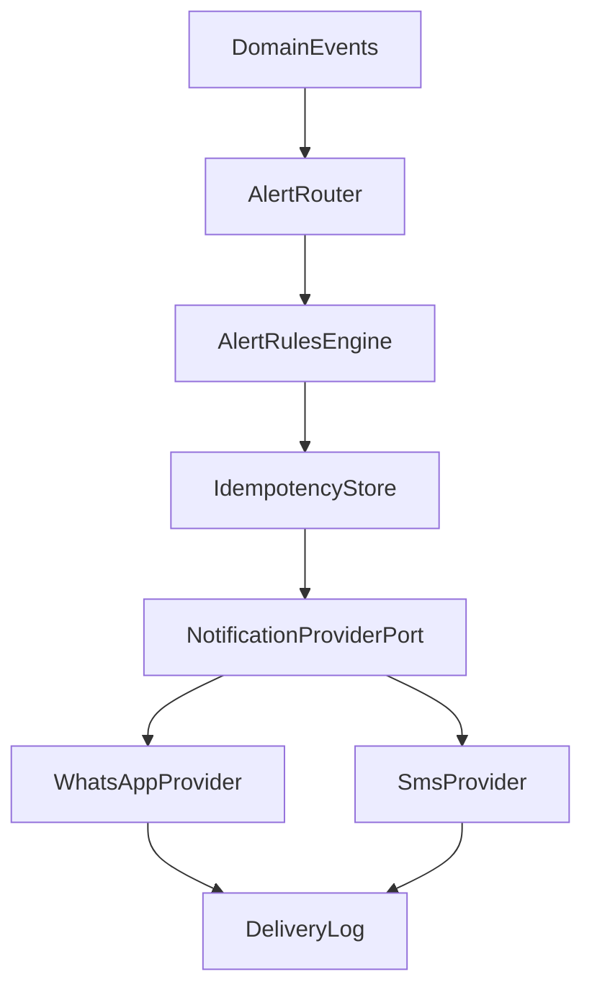

# Alerts Architecture (WhatsApp + SMS)

## Purpose
Define the alerting architecture for future implementation so operational events can notify operators through WhatsApp and SMS without duplicate or noisy delivery.

## Scope
- Design only. No runtime implementation in this document.
- Covers event routing, trigger evaluation, suppression, dedupe, and provider port boundaries.
- Provider contract and retry policy are defined in `provider-interface.md`.

## High-Level Flow

## Trigger Matrix
| Event | Condition | Severity | Suppression window |
|---|---|---|---|
| `SYNC_RUN_FAILED` | Latest sync run status is failed | high | 1h |
| `UNASSIGNED_BACKLOG_THRESHOLD_REACHED` | Unassigned bookings count exceeds threshold for 24h | medium | 24h |
| `CLEANING_OVERDUE` | Cleaning task passed planned end time and remains incomplete | high | 4h |
| `CONFLICT_RESOLUTION_REQUIRED` | Assignment conflict unresolved beyond response SLA | high | 2h |

## Threshold and Suppression Rules
- Trigger thresholds are evaluated per event definition in `event-catalog.md`.
- Suppression window applies per `(eventType, scopeKey)` to prevent repetitive alerts for the same operational issue.
- Escalation from `medium` to `high` is allowed when duration or impact increases.

## Dedupe and Idempotency
- Every outbound notification must use a deterministic `idempotencyKey`.
- The key should include event identity and affected scope so retries do not create duplicate user-visible messages.
- A repeated event with identical `idempotencyKey` during suppression must be recorded but not resent.

## Privacy and Data Minimization
- Alert payloads should contain only operational metadata required for action.
- Avoid direct PII in message templates where possible.
- Logging must avoid full phone numbers and unnecessary guest identity detail.
